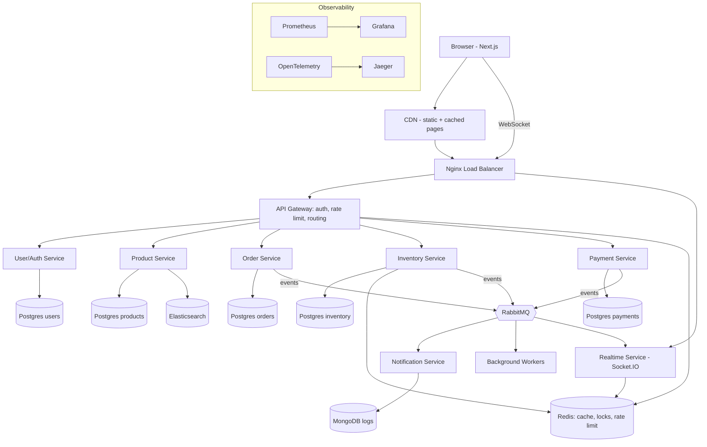
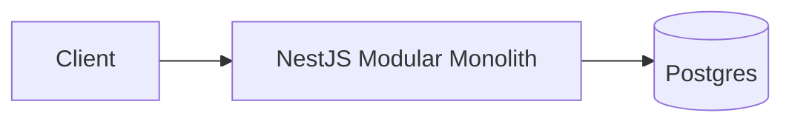
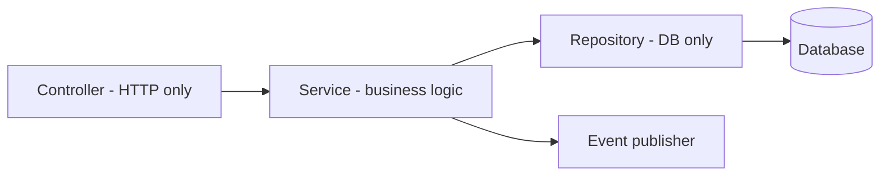

# 01 - System Architecture

## Target architecture (end state, Phase 8)

## Phase 1 architecture (start here)

One deployable app. Modules: auth, users, products, inventory, orders, payments, notifications, realtime.

## Layers inside a backend module

## NestJS request lifecycle
Request -> Middleware -> Guard -> Interceptor(before) -> Pipe -> Controller -> Service -> Repository
-> Interceptor(after) -> Exception Filter (on error) -> Response

## Tech map
| Concern | Tool | Phase |
|---|---|---|
| API framework | NestJS | 1 |
| Main DB | PostgreSQL + Prisma | 1 |
| Cache, locks, rate limit | Redis | 2, 6, 7 |
| Queue | RabbitMQ | 3 |
| Realtime | Socket.IO + Redis adapter | 4 |
| Search | Elasticsearch | 7 |
| LB | Nginx | 6 |
| Orchestration | Kubernetes | 7 |
| Metrics/traces | Prometheus, Grafana, OpenTelemetry | 8 |