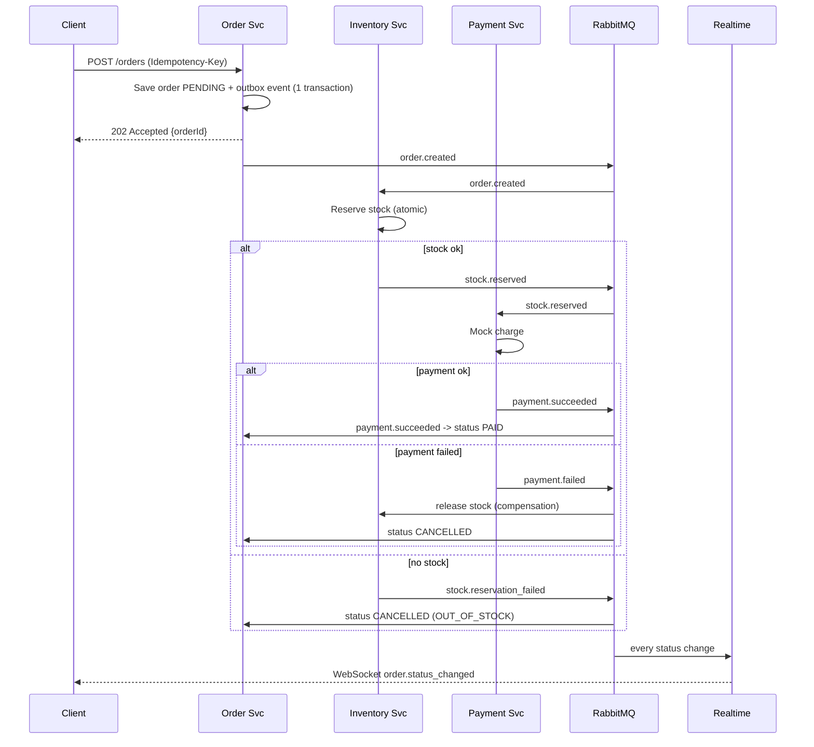
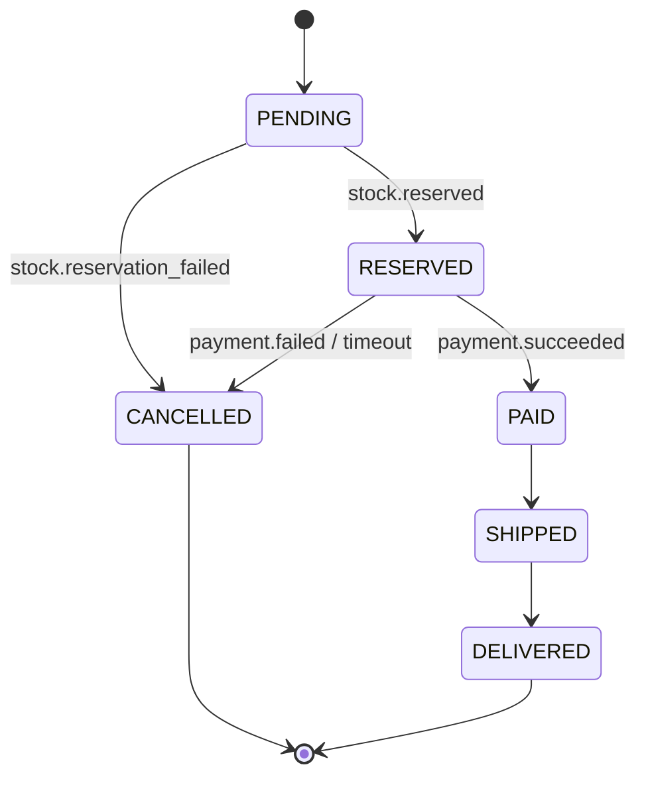
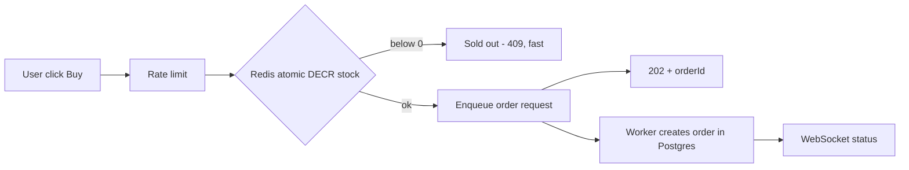

# 03 - Key Flows

## Flow 1: Place order (saga, choreography)

## Order state machine

Invalid transitions must throw. Put the transition table in one place in the order service.

## Flow 2: Flash-sale buy (hot path, Phase 7)

Idea: reject losers in Redis in microseconds, only winners touch Postgres.

## Flow 3: Auth with refresh rotation
1. Login -> access JWT (15m) + refresh token (7d, stored hashed in DB, httpOnly cookie)
2. Access expired -> POST /auth/refresh -> new pair, old refresh revoked
3. Old refresh reused -> revoke the whole token family (theft detection)

## Flow 4: Realtime connection
1. Client connects with JWT -> gateway verifies -> joins room `user:{userId}`
2. Event consumer receives `order.*` -> emits to `user:{userId}`
3. With many instances, Redis adapter forwards to the instance holding that socket
4. On reconnect, client refetches orders via REST (socket is a hint, REST is truth)
