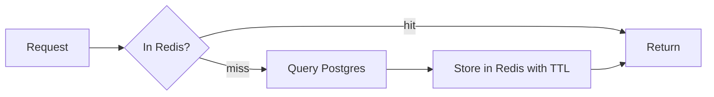

# 05 - Caching Strategy

## Layers
| Layer | What | TTL | Invalidation |
|---|---|---|---|
| Browser / HTTP | Cache-Control + ETag on GET /products | 30s | revalidate |
| CDN | Static assets, product pages (ISR) | 60s | on product update |
| Redis | Product list/detail, search results | 60s-10m | delete on write |
| DB | Shared buffers, indexes | - | - |

## Pattern: cache-aside

## Problems and solutions (learn each one)
| Problem | Meaning | Fix |
|---|---|---|
| Cache stampede | Hot key expires, 1000 requests hit DB | Lock/single-flight, TTL jitter |
| Cache penetration | Requests for nonexistent IDs bypass cache | Cache null for 30s, Bloom filter later |
| Stale data | Cache differs from DB | Delete on write, short TTL |
| Hot key | One product gets all traffic | Local in-memory L1 cache + Redis L2 |

## Rules
- Never cache inventory counts shown for purchase decisions (display only, with TTL 1-2s)
- Never cache user-specific private data in shared keys
- Key naming: see database/03-redis-keys.md
- Always set TTL. No key lives forever (except config)