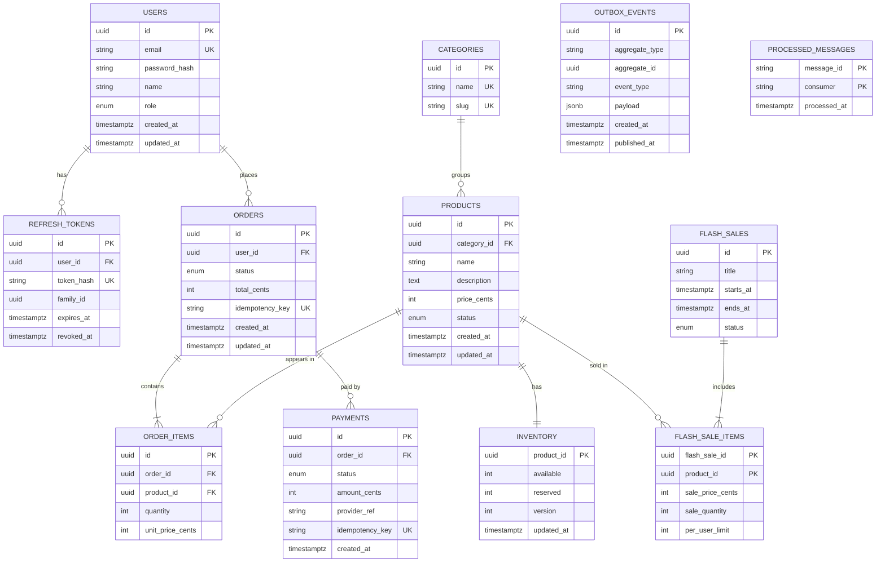

# 00 - ERD

## Relationship notes
- 1 user -> many orders; 1 order -> many items; 1 order -> maybe many payment attempts
- inventory is 1:1 with product (split from products because it is updated far more often: avoids bloating hot rows)
- order_items copies unit_price_cents so later price changes never rewrite history
- outbox_events and processed_messages are infrastructure tables (Phase 3 and 5)